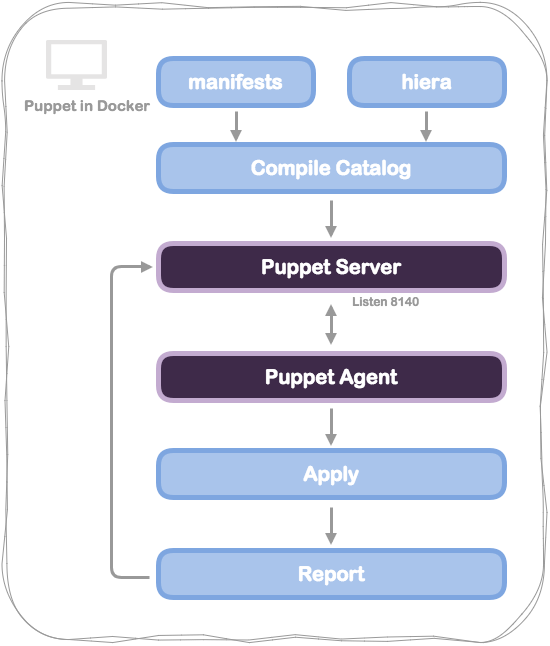

# Puppet in Docker


The example is puppet server and agent both in docker

## Architecture



## HowTo

### Automake Setup

- build docker for puppet master

```
$ cd puppet-master-docker/
$ make install
```

- verify puppetserver running

```
$ make status
or
$ docker exec -it puppet-master netstat -tunlp
```

---

### Example code

- install apache2

```
# site.pp
node default {
  package { 'apache2':
    ensure => present,
  }
}
```

### Apply puppet agent

```
$ make deploy
or
$ docker exec -it puppet-master puppet agent -t


## How to get image

```
$ docker pull shazi7804/puppet-master
``````
